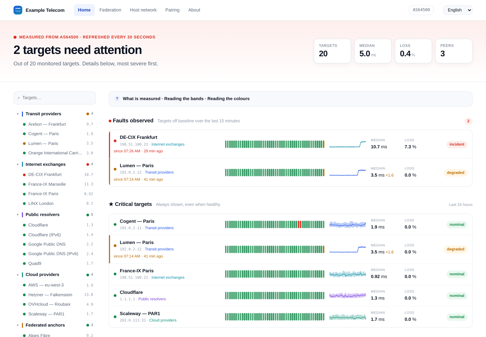
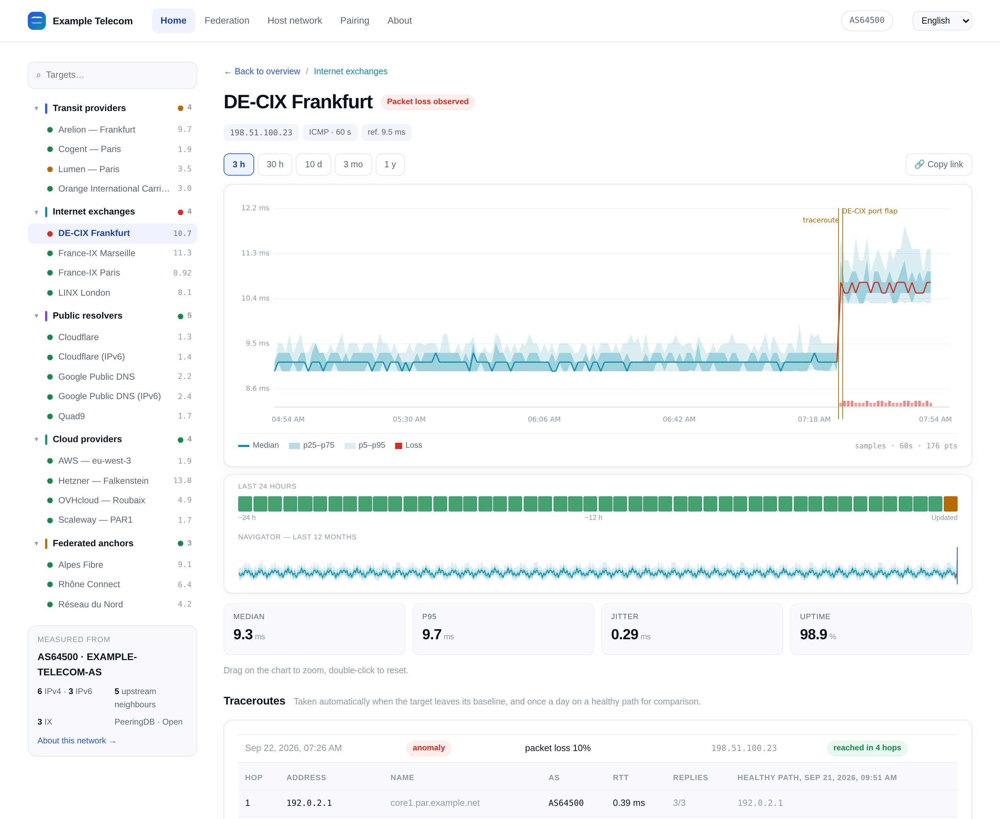
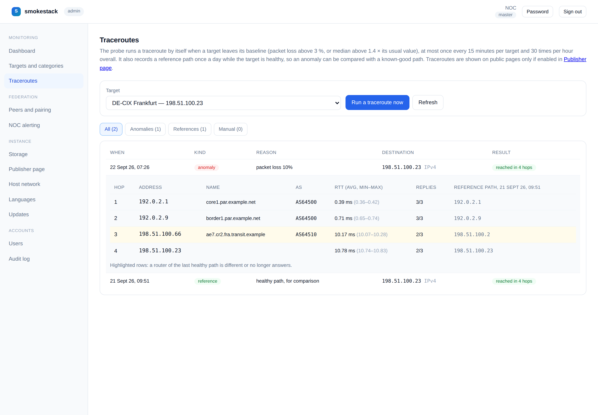
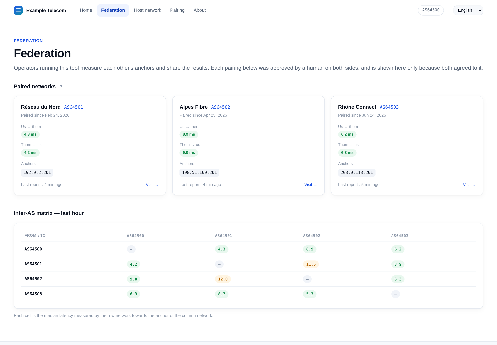
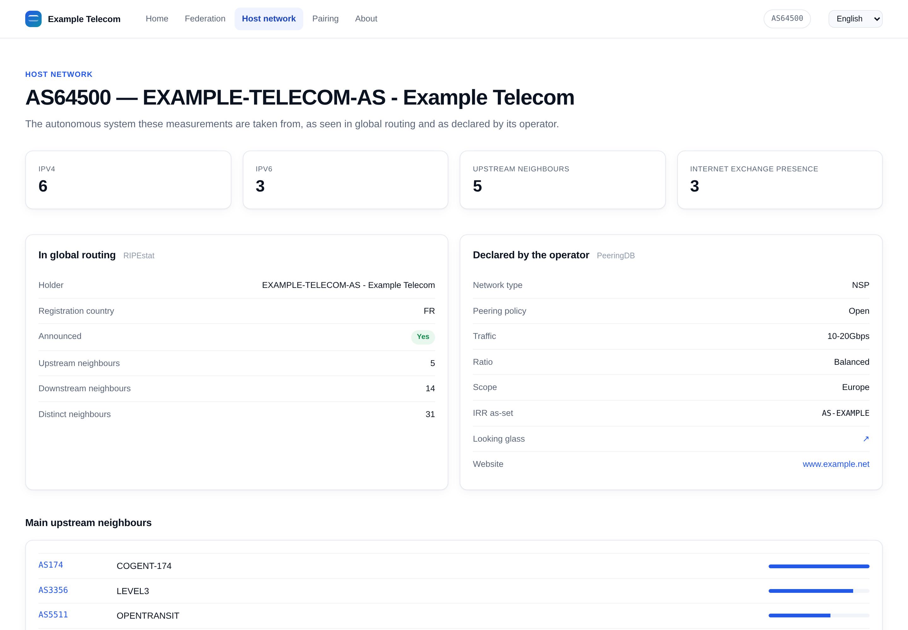
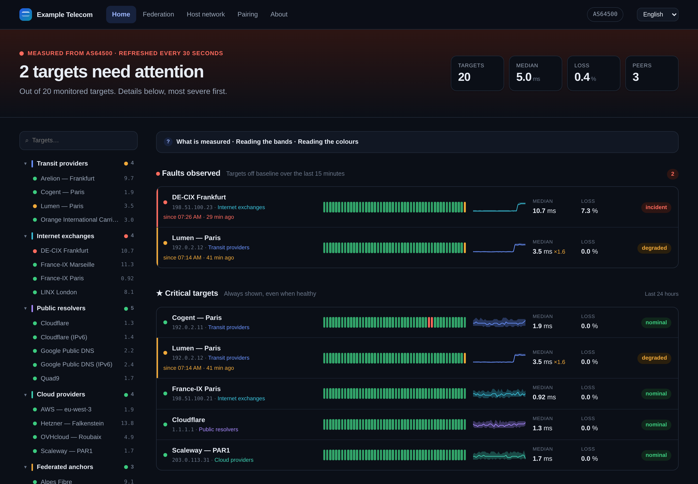
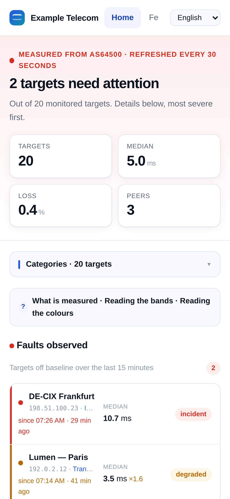

# smokestack

[](https://github.com/nkglfr/smokestack/actions/workflows/ci.yml)
[](https://github.com/nkglfr/smokestack/releases/latest)
[](LICENSE)

**Public latency monitoring for network operators.** A modern take on
SmokePing: one binary, fast graphs, exact percentiles, and a federation
between operators who measure each other.

- 📈 **Latency, jitter and loss** to your transits, exchanges, DNS resolvers and clouds
- 🔍 **Zoom from one year down to 30 seconds**, percentiles stay exact at every level
- 🧭 **Traceroute on anomalies**, compared with the last healthy path, over IPv4 and IPv6
- 🌍 **Public status page in 10 languages**, with a private back-office
- 🤝 **Federation**: pair with other operators, measure each other, get notified of incidents
- 📦 **One static binary**, SQLite inside, optional S3 archive, installs in under a minute



---

## Quick start

On any Linux server with systemd (amd64 or arm64):

```sh
curl -fsSLO https://github.com/nkglfr/smokestack/releases/latest/download/install.sh
sudo sh install.sh --admin-email noc@example.net
```

Already root, as on a fresh Debian? Drop `sudo`. The installer prints the
back-office address and the admin password.

On a first installation the installer asks for the listen IP and port;
press Enter to keep the default, `127.0.0.1:8080` (this machine only). You can
also give them directly, for instance `--ip 0.0.0.0 --port 80` to reach the
interface from your network while testing, and `--yes` skips all questions. For production, put a TLS reverse proxy in
front, for example with Caddy:

```
latency.example.net {
    reverse_proxy 127.0.0.1:8080
}
```

Then open `https://latency.example.net/admin`, set your AS number and add
your targets.

📘 Full guide: **[DEPLOY.md](DEPLOY.md)** (HTTPS, updates, backups, troubleshooting).

---

## Screenshots

<table>
<tr>
<td width="50%"><a href="docs/screenshots/detail.png"></a></td>
<td width="50%"><a href="docs/screenshots/traceroutes.png"></a></td>
</tr>
<tr>
<td align="center"><b>Target detail</b><br>Percentile bands, loss bars, events, zoom from one year down to 30 seconds</td>
<td align="center"><b>Traceroute on anomalies</b><br>Taken automatically, compared hop by hop with the last healthy path</td>
</tr>
<tr>
<td width="50%"><a href="docs/screenshots/federation.png"></a></td>
<td width="50%"><a href="docs/screenshots/network.png"></a></td>
</tr>
<tr>
<td align="center"><b>Federation</b><br>Operators measure each other, latency in both directions, inter-AS matrix</td>
<td align="center"><b>Host network</b><br>Your AS as seen in global routing (RIPEstat) and declared on PeeringDB</td>
</tr>
<tr>
<td width="50%"><a href="docs/screenshots/home-dark.png"></a></td>
<td width="50%" align="center"><a href="docs/screenshots/mobile.png"></a></td>
</tr>
<tr>
<td align="center"><b>Dark theme</b><br>Follows the visitor's system setting</td>
<td align="center"><b>Mobile</b><br>Responsive, faults first</td>
</tr>
</table>

<sub>Screenshots use a demo data set: fictitious operators and documentation addresses (RFC 5737, RFC 3849, RFC 5398).</sub>

---

## Why smokestack

| | SmokePing | smokestack |
|---|---|---|
| Graphs | Rendered on the server at every page view | Drawn in the browser, from pre-aggregated data |
| Percentiles over long periods | Averaged (inaccurate) | Merged histograms (exact) |
| Measurements under server load | Skewed | Kernel timestamps, isolated probe process |
| Storage | RRD files | SQLite + optional S3 archive of raw data |
| Deployment | Perl, fping, rrdtool, web server | One binary |
| Updates | Manual | Signed packages, one click, automatic rollback |

---

## How it works

```
                 Unix socket                    HTTPS
 ┌──────────────┐  targets  ┌──────────────────┐  ┌──────────────────┐
 │ smokestack   │◄──────────│ smokestack       │─►│ reverse proxy    │─► visitors
 │ probe        │──────────►│ web service      │  │ (Caddy, nginx)   │
 │ ICMP / TCP   │ results   │ API · UI · SQLite│  └──────────────────┘
 └──────────────┘           └────────┬─────────┘
  CAP_NET_RAW only                   │ hourly raw archive
  high CPU priority                  ▼
                               S3 (optional)
```

- **The probe runs in its own process.** It is the only one allowed raw
  sockets, it has CPU priority, and replies are timestamped by the kernel.
  Heavy traffic on the website cannot distort a measurement.
- **Percentiles are exact at every zoom level.** Each measurement is stored
  as a small mergeable histogram (DDSketch, 1 % relative error), rolled up
  into 1 min, 5 min, 1 h and 1 day buckets.
- **The right resolution is picked automatically** from the time window you
  look at: raw samples for a few hours, daily buckets for years.
- **Disk usage is bounded.** Raw data is archived hourly to S3 or kept
  locally with a quota; long-term aggregates are never evicted.

Benchmark on one saturated CPU core, loopback targets (true RTT ≈ 0.03 ms):
under web load the probe measures **0.016 ms median, 0.041 ms worst**,
versus 1.7 ms and 50 ms with a naive single-process design.
Details in [DEPLOY.md § 10](DEPLOY.md#10-probe-isolation-and-performance).

---

## Features

**Public site**
- Status overview: faults first, critical targets, all categories
- 24-hour status bar and sparkline per target
- Detail view with drag-to-zoom, 1-year navigator, event annotations, permalinks
- Anomaly traceroutes marked on the graph (optional, off by default)
- Host network page: your AS from RIPEstat and PeeringDB
- Federation page: paired networks and inter-AS latency matrix
- Light and dark themes, responsive, in 10 languages (the visitor's browser language is picked automatically)

**Back-office**
- Accounts with four roles (viewer, editor, admin, master) and an audit log
- Targets and categories, ICMP or TCP, IPv4 or IPv6, every 30 s, 1, 5 or 10 min
- A catalogue of ready-made targets to enable in one click
- Public or **private** targets: private ones are measured and visible in the back-office only
- Traceroutes: automatic on anomalies, daily reference path, on demand, with path comparison
- Storage settings (local quota or S3), publisher page, languages
- One-click updates with rollback

**Federation**
- Pairing between instances, approved by a human on both sides
- Ed25519-signed messages, fingerprints compared out of band
- Pairings shown publicly only if both operators agree
- NOC alerts only when several independent observers confirm an incident

---

## Updating

Every release is a signed `.zip`. From the back-office (*Instance → Updates*),
the command line, or automatically:

```sh
sudo smokestack update smokestack-1.3.0-linux-amd64.zip
sudo smokestack rollback
```

The package signature, platform and checksum are verified, the new binary
tests itself, the configuration database is backed up, and the switch is
atomic. If the new version fails to start three times, the previous one is
restored automatically.

The service checks for new versions once a day (6 hours, a week or a month
are also available) and shows them in the back-office. Skipping versions is
harmless: the newest release is installed directly. Automatic installation is optional (off by default) and only
ever installs signed releases, never pre-releases. Details:
[DEPLOY.md § 5](DEPLOY.md#5-updating).

---

## Configuration

`/etc/smokestack/config.json`, written by the installer:

```json
{
  "data_dir": "/var/lib/smokestack",
  "probe": { "enabled": true, "mode": "external", "slug": "par-01", "name": "Paris",
             "traceroute": { "max_hops": 30, "reference_hours": 24 } },
  "update": { "auto_check": true, "auto_apply": false, "check_interval_hours": 24 }
}
```

The listen address has its own small file, `/etc/smokestack/smokestack.env`:

```sh
SMOKESTACK_LISTEN_IP=127.0.0.1      # * or 0.0.0.0 for all IPv4 interfaces, :: for IPv4 and IPv6
SMOKESTACK_LISTEN_PORT=8080
```

Edit it, then `systemctl restart smokestack`. The same settings exist as
flags (`-ip`, `-port`) and in `config.json` (`listen_ip`, `listen_port`);
flags win over environment variables, which win over `config.json`.

Everything else (targets, storage, S3, languages, federation, users) is set
from the back-office.

---

## Containers

An image is published with each release:

```sh
docker run -d --network host --cap-add NET_RAW \
  -v smokestack-data:/var/lib/smokestack ghcr.io/nkglfr/smokestack:latest
```

The **host network is mandatory**: on Docker's default bridge, the probes
cross a NAT that adds latency and jitter, traceroutes start with a bogus hop,
and IPv6 is off. Containers are meant for tests and for container-only
setups; for published measurements prefer the native install, which also
brings signed in-place updates and an isolated, CPU-prioritised probe. Full
disclaimer: [DEPLOY.md § 12](DEPLOY.md#12-container-image-tests).

---

## Languages

Public pages are available in:

| Code | Language | Code | Language |
|---|---|---|---|
| `en` | English (reference) | `it` | Italiano |
| `da` | Dansk | `nb` | Norsk bokmål |
| `de` | Deutsch | `nl` | Nederlands |
| `es` | Español | `pt` | Português |
| `fr` | Français | `sv` | Svenska |

The visitor's browser language is used automatically, and a selector lets
them switch. Choose the default language of your instance at install time
(`--lang fr`) or later:

```sh
smokestack languages                 # list the available languages
smokestack languages -default fr     # set the default language of public pages
```

Adding a language is a single JSON file, without rebuilding: see
[DEPLOY.md § 4](DEPLOY.md#4-first-steps). The back-office is in English.

---

## API

Public, read-only, JSON:

| Endpoint | |
|---|---|
| `GET /api/v1/overview` | Status of every public target |
| `GET /api/v1/tree` | Categories and targets |
| `GET /api/v1/series?target=ID&from=-30h&points=600` | Percentiles and loss over time |
| `GET /api/v1/events` | Annotated events |
| `GET /api/v1/live` | Server-sent events, latest measurements |
| `GET /api/v1/asn` | Host network (RIPEstat, PeeringDB) |
| `GET /api/v1/fed/peers` | Public federation peers |
| `GET /api/v1/traceroutes?target=ID` | Traceroutes, if made public by the operator |

Private targets never appear in these endpoints. An authenticated call (session
cookie or `Authorization: Bearer <admin token>`) sees them, and
`/api/v1/overview?all=1` returns them too.
| `GET /healthz` | Health check |

Rate limit: 20 requests/s per client IP, bursts of 80.

---

## Building from source

Requires Go 1.22 or later. On Debian or Ubuntu:

```sh
apt install -y git make golang-go
git clone https://github.com/nkglfr/smokestack && cd smokestack
make test
make build                              # ./dist/smokestack
sudo sh install.sh --package dist/smokestack --admin-email noc@example.net
```

### Releasing

```sh
make release-key                        # once: signing key pair (see DEPLOY.md § 6)
git tag v1.3.0 && git push origin v1.3.0
```

Pushing the tag is all it takes: GitHub Actions runs the tests, builds
linux/amd64 and linux/arm64, signs the packages and publishes the release
(do not create the release by hand in the GitHub interface). Instances with automatic updates install it within a
few hours. See [DEPLOY.md § 6](DEPLOY.md#6-publishing-your-own-releases).

---

## Security

- The web interface is embedded in the binary: no document root, databases
  and keys are never reachable over HTTP.
- The first admin account requires a one-time setup code.
- The web service has no raw-socket privilege; the probe has nothing else.
- Hardened systemd units: read-only system, private `/tmp`, no new privileges.
- Updates must be signed by a trusted Ed25519 key.

---

## Status

Working and tested, not yet 1.0. Known gaps:

- IPv6 has been tested with crafted packets only so far; feedback from dual-stack hosts is welcome
- Latency-triggered traceroutes are covered by unit tests; loss-triggered ones were tested on a multi-hop lab network
- Remote probes on another machine (same-host isolation is done)

Design notes: [docs/DESIGN.md](docs/DESIGN.md) (French version: [DESIGN.fr.md](docs/DESIGN.fr.md)).

---

## License

smokestack is released under the [Apache License 2.0](LICENSE).
